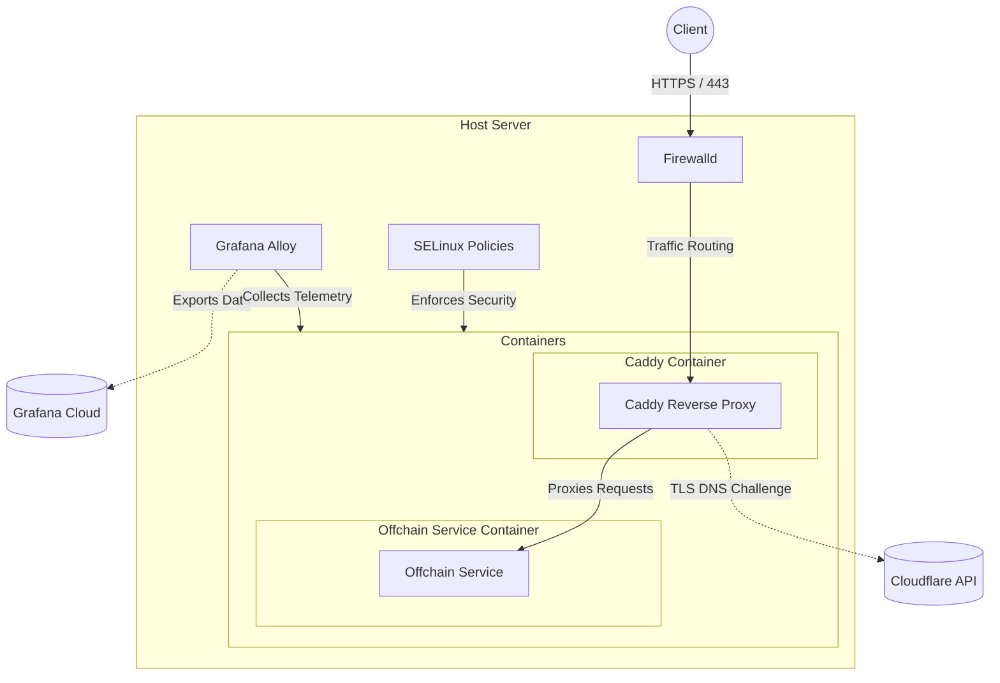

# Infrastructure

## Setup

1. Place the necessary SSH key file in your `~/.ssh/` directory.

- e.g. `~/.ssh/id_ssn_test_deployment` and `~/.ssh/id_ssn_test_deployment.pub` for test.
- e.g. `~/.ssh/id_ssn_prod_deployment` and `~/.ssh/id_ssn_prod_deployment.pub` for prod.

2. Set the correct permissions for the SSH key files:
   - The `~/.ssh` directory:
     ```shell
     chmod 700 ~/.ssh
     ```
   - The private key file (replace with the correct file name):
     ```shell
     chmod 600 ~/.ssh/id_ed25519
     ```
   - The public key file (replace with the correct file name):
     ```shell
     chmod 644 ~/.ssh/id_ed25519.pub
     ```
3. Install [`docker`](https://www.docker.com/).

To generate PKCS8 key:

```shell
openssl genpkey -algorithm ed25519 -out id_ed25519_pkcs8.pem
```

## ENV Variables

Create a `.env.test` and `.env.prod` files with the following variables:

```shell
KEY_FILE="${KEY_FILE}"
REMOTE_USER="${REMOTE_USER}"
REMOTE_HOST="${REMOTE_HOST}"
ELASTIC_IP="${ELASTIC_IP}" # this should only be set for VPSs that have an assigned elastic IP address (i.e. prod)
CLOUDFLARE_API_TOKEN="${CLOUDFLARE_API_TOKEN}"

PRIVATE_KEY="${PRIVATE_KEY}"
FRONTEND_URL="${FRONTEND_URL}"
OFFCHAIN_SERVICE_DOMAIN="${OFFCHAIN_SERVICE_DOMAIN}"

SMTP_HOST="${SMTP_HOST}"
SMTP_PORT="${SMTP_PORT}"
SMTP_USER="${SMTP_USER}"
SMTP_PASS="${SMTP_PASS}"
SMTP_FROM="${SMTP_FROM}"
PORT="${PORT}"

GRAFANA_ENVIRONMENT="${GRAFANA_ENVIRONMENT}"
GRAFANA_SCRAPE_INTERVAL="${GRAFANA_SCRAPE_INTERVAL}"
GRAFANA_HOSTED_OTLP_URL="${GRAFANA_HOSTED_OTLP_URL}"
GRAFANA_HOSTED_OTLP_ID="${GRAFANA_HOSTED_OTLP_ID}"
GRAFANA_HOSTED_METRICS_URL="${GRAFANA_HOSTED_METRICS_URL}"
GRAFANA_HOSTED_METRICS_ID="${GRAFANA_HOSTED_METRICS_ID}"
GRAFANA_HOSTED_LOGS_URL="${GRAFANA_HOSTED_LOGS_URL}"
GRAFANA_HOSTED_LOGS_ID="${GRAFANA_HOSTED_LOGS_ID}"
GRAFANA_RW_API_KEY="${GRAFANA_RW_API_KEY}"
```

### VPS Setup

VPS are setup on Exoscale.

- Name: `${ENV}-${ZONE}-${NUM}` e.g. `dev-dk-2-1`, `prod-dk-2-1`.
- Rocky Linux OS (Alma and RHEL would also work).
- Zone: `CH-DK-2`
- Standard, tiny server. (1 CPU / 1 GB RAM).
- Disk size: 50 GB.
- Assign the appropriate SSH key.
- Add the HTTP and SSH security groups.

HTTP Security Group ports:

- 80/tcp
- 443/tcp
- 443/udp

SSH Security Group ports:

- 22/tcp

### Test Server

## Initial Server Setup

Run the following command to setup a new Test server:

```shell
./scripts/initial-server-setup.sh ./.env.test
```

## Deploy

Run the following command to deploy containers to the Test server:

```shell
./scripts/deploy-containers.sh ./.env.test
```

## Server Maintenance

Run the following command to run Test server maintenance:

```shell
./scripts/server-maintenance.sh ./.env.test
```

## Known Host Entry

Run the following command to print the ECDSA SSH known host entries for the Test server:

```shell
source ./.env.test && ssh-keyscan -t ecdsa -H ${REMOTE_HOST}
```

## SSH

Run the following command to SSH into the Test server:

```shell
source ./.env.test && ssh -i ${KEY_FILE} ${REMOTE_USER}@${REMOTE_HOST}
```

### Prod Server

## Initial Server Setup

Run the following command to setup a new Prod server:

```shell
./scripts/initial-server-setup.sh ./.env.prod
```

## Deploy

Run the following command to deploy containers to the Prod server:

```shell
./scripts/deploy-containers.sh ./.env.prod
```

## Server Maintenance

Run the following command to run Prod server maintenance:

```shell
./scripts/server-maintenance.sh ./.env.prod
```

## Known Host Entry

Run the following command to print the ECDSA SSH known host entries for the Prod server:

```shell
source ./.env.prod && ssh-keyscan -t ecdsa -H ${REMOTE_HOST}
```

## SSH

Run the following command to SSH into the Prod server:

```shell
source ./.env.prod && ssh -i ${KEY_FILE} ${REMOTE_USER}@${REMOTE_HOST}
```

## Tools Overview

The infrastructure and deployment utilize the following core tools and technologies:

- **Podman & Quadlets**: Runs containers seamlessly and integrates with Systemd (via Quadlets) to manage container lifecycles natively as user services.
- **Caddy**: Serves as the reverse proxy. It routes traffic to the backend containers and handles automatic TLS certificate provisioning using the Cloudflare DNS challenge.
- **SELinux**: Enforces strict security boundaries and access controls for the containers through custom `.cil` policies.
- **Bun & ElysiaJS**: The `offchain-service` is built using the Bun runtime/bundler and the ElysiaJS web framework, compiling into a standalone binary for the container.
- **Grafana Alloy**: Installed as a system service to collect and forward telemetry data (metrics, logs, and traces).
- **Fail2ban**: Secures the host against SSH brute-force attacks.
- **dnf-automatic**: Automatically applies security updates to keep the underlying OS secure.

## Architecture Diagram

The following diagram illustrates the relationship between the infrastructure components:


